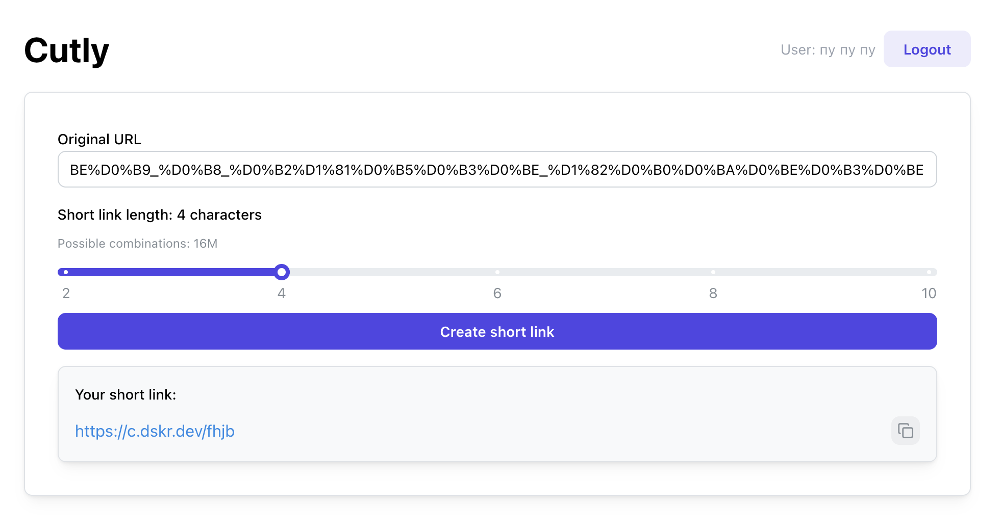

# Cutly - URL Shortener Service

A modern, self-hosted URL shortener service built with TanStack Start, React, Prisma, and SQLite. Features optional OIDC authentication and a clean, user-friendly interface.



> **⚠️ Warning**: This project is under active development and is not ready for production use. Use at your own risk.

## Features

- 🔗 **URL Shortening**: Create short links from long URLs
- 🔐 **Optional Authentication**: OIDC-based authentication (can be disabled)
- 📊 **Click Tracking**: Track clicks with IP address and user agent information
- 🎨 **Modern UI**: Built with Mantine UI components
- 🚀 **Fast**: Powered by Bun runtime and TanStack Start
- 🐳 **Docker Ready**: Includes Dockerfile and compose configuration
- 💾 **SQLite Database**: Lightweight, file-based database

📋 See [Release Notes](RELEASE_NOTES.md) for version history and changes.

## Quick Start

### Using Docker Compose (Recommended)

1. **Download `compose.yml`**
   ```bash
   curl -O https://github.com/skrylnikov/cutly/releases/download/v0.1.1/compose.yml
   ```

2. **Configure environment variables** (optional)
   
   Edit `compose.yml` and replace the environment variable placeholders with your values:
   
   ```yaml
   environment:
     # Database configuration
     - DATABASE_URL=file:/app/data/app.db
     
     # OIDC Configuration (optional - leave empty to disable authentication)
     - OIDC_ISSUER=https://your-oidc-provider.com
     - OIDC_CLIENT_ID=your-client-id
     - OIDC_CLIENT_SECRET=your-client-secret
     
     # Application URL (optional - defaults to http://localhost:3000)
     - APP_URL=http://localhost:3000
   ```
   
   If you don't need authentication, you can leave the OIDC variables empty (they default to empty strings).

3. **Start the service**
   ```bash
   docker compose up -d
   ```

4. **View logs**
   ```bash
   docker compose logs -f
   ```

5. **Stop the service**
   ```bash
   docker compose down
   ```

The application will be available at `http://localhost:3000` (or the port you configured).

### Using Docker directly

1. **Build the image**
   ```bash
   docker build -t cutly-app .
   ```

2. **Run the container**
   ```bash
   docker run -d \
     --name cutly-app \
     -p 3000:3000 \
     -v $(pwd)/data:/app/data \
     -e DATABASE_URL="file:/app/data/dev.db" \
     -e APP_URL="http://localhost:3000" \
     ghcr.io/skrylnikov/cutly:0.1.1
   ```

## Environment Variables

The application uses the following environment variables:

### Required Variables

| Variable | Description | Example |
|----------|-------------|---------|
| `DATABASE_URL` | SQLite database connection string. Use `file:` prefix for SQLite. | `file:./dev.db` or `file:/app/data/dev.db` |

### Optional Variables

| Variable | Description | Default | Example |
|----------|-------------|---------|---------|
| `APP_URL` | Application URL. Used for generating short link URLs. | `http://localhost:3000` | `https://short.ly` |
| `OIDC_ISSUER` | OIDC provider issuer URL. If not set, authentication is disabled. | - | `https://accounts.google.com` |
| `OIDC_CLIENT_ID` | OIDC client ID. Required if OIDC authentication is enabled. | - | `your-client-id` |
| `OIDC_CLIENT_SECRET` | OIDC client secret. Required if OIDC authentication is enabled. | - | `your-client-secret` |

### Environment Variable Details

#### `DATABASE_URL`

- **Type**: Required
- **Format**: SQLite connection string with `file:` prefix
- **Examples**:
  - Local development: `file:./dev.db`
  - Docker: `file:/app/data/dev.db`
  - Absolute path: `file:/var/lib/cutly/database.db`

#### `APP_URL`

- **Type**: Optional
- **Purpose**: Used to generate full short link URLs
- **When to set**: 
  - When deploying behind a reverse proxy
  - When using a custom domain
  - When the application is not accessible at `http://localhost:3000`
- **Example**: If your app is accessible at `https://short.ly`, set `APP_URL=https://short.ly`

#### OIDC Configuration (`OIDC_ISSUER`, `OIDC_CLIENT_ID`, `OIDC_CLIENT_SECRET`)

- **Type**: Optional (all three must be set together to enable authentication)
- **Purpose**: Enable OIDC-based user authentication
- **Behavior**:
  - If all three variables are set: Authentication is enabled, users must log in to create short links
  - If any are missing: Authentication is disabled, anyone can create short links
- **Supported Providers**: Any OIDC-compliant provider (Google, Auth0, Keycloak, etc.)
- **Setup**:
  1. Register your application with your OIDC provider
  2. Set the redirect URI to: `{APP_URL}/api/auth/callback`
  3. Configure the three environment variables


## Development

0. **Prerequisites**: Install [Bun](https://bun.sh) (v1.3.3 or higher)

1. **Clone the repository**
   ```bash
   git clone git@github.com:skrylnikov/cutly.git
   cd cutly
   ```

2. **Install dependencies**
   ```bash
   bun install
   ```

3. **Set up environment variables**
   ```bash
   cp env.example .env.local
   ```
   Edit `.env.local` with your configuration (see [Environment Variables](#environment-variables) section).

4. **Set up the database**
   ```bash
   bun run db:push
   ```

5. **Start the development server**
   ```bash
   bun run dev
   ```

   The application will be available at `http://localhost:3000`


## Database Management

### Prisma Commands

The project uses Prisma for database management. Available commands:

```bash
# Generate Prisma client
bun run db:generate

# Push schema changes to database (development)
bun run db:push

# Run migrations
bun run db:migrate

# Open Prisma Studio (database GUI)
bun run db:studio

# Seed database (if configured)
bun run db:seed
```

### Database Schema

The application uses two main models:

- **ShortLink**: Stores original URLs, short IDs, and metadata
- **Click**: Tracks clicks on short links with IP, user agent, and timestamp

## API Endpoints

### Public Endpoints

- `GET /` - Home page with URL shortening form
- `GET /:shortId` - Redirect to original URL (tracks click)

### Authentication Endpoints (if OIDC is enabled)

- `GET /api/auth/login` - Initiate OIDC login flow
- `GET /api/auth/callback` - OIDC callback handler
- `GET /api/auth/logout` - Logout user

## Development

### Available Scripts

```bash
# Development
bun run dev              # Start development server

# Building
bun run build            # Build for production
bun run serve            # Preview production build

# Code Quality
bun run lint             # Run linter
bun run format           # Format code
bun run check            # Run linter and formatter
bun run type-check       # TypeScript type checking

# Database
bun run db:generate      # Generate Prisma client
bun run db:push          # Push schema changes
bun run db:migrate       # Run migrations
bun run db:studio        # Open Prisma Studio
```

### Project Structure

```
cutly/
├── prisma/              # Prisma schema and migrations
├── public/              # Static assets
├── src/
│   ├── components/      # React components
│   ├── generated/       # Generated Prisma client
│   ├── lib/             # Utility functions and libraries
│   ├── routes/          # TanStack Router routes
│   ├── app.tsx          # Application entry point
│   ├── db.ts            # Database client
│   └── router.tsx       # Router configuration
├── Dockerfile           # Docker image definition
├── compose.yml          # Docker Compose configuration
└── package.json         # Dependencies and scripts
```


## Troubleshooting

### Database Issues

- **Database locked**: Ensure only one instance is accessing the database file
- **Migration errors**: Check that the database file is writable
- **Path issues**: Use absolute paths in Docker environments

### Authentication Issues

- **OIDC not working**: Verify all three OIDC variables are set correctly
- **Callback errors**: Ensure `APP_URL` matches your public URL
- **Redirect URI mismatch**: Check that the redirect URI in your OIDC provider matches `{APP_URL}/api/auth/callback`

### Port Conflicts

- Change the port in `compose.yml` or use environment variables
- Update `APP_URL` if using a different port

## License

Licensed under the [MIT License](LICENSE).
